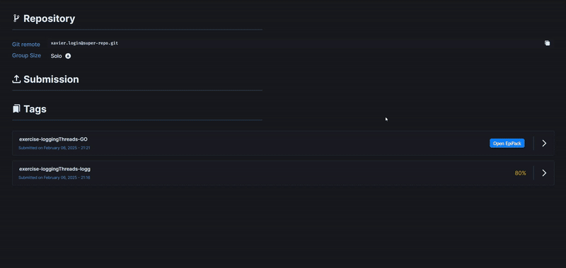

# EPITRACE Packs Extension - Crossplatform Chrome & Firefox extension !

## Download

### Firefix based browser
You can install the extension directly from the Mozilla addons:

[**Download from Mozilla**](https://addons.mozilla.org/firefox/downloads/file/4508497/50ff204e3f9641388f39-1.0.xpi)

---

### Manual Installation for Chrome based browser
You can also download the latest `.zip` version from the GitHub Releases page:

[**GitHub Releases**](https://github.com/Axthauvin/epitrace-packs/releases/)

> 🛠️ To install manually in Chrome:
> 1. Download and unzip the archive.
> 2. Open `chrome://extensions` in your browser.
> 3. Enable **Developer Mode** (top-right).
> 4. Click **"Load unpacked"** and select the extracted folder.

## Overview

The EPITRACE Packs extension is a web extension designed to enhance the experience of EPITA students. This extension allows users to open traces as FIFA packs, adding an element of fun during projects or piscines, and providing an **_opportunity to flex_**.

## Features

- **Open Traces as FIFA Packs**: Transform your traces into FIFA packs for an engaging experience.

- **Flex Your Achievements**: Flex in front of your friends when you have a icon pack !

## Installation

To install the EPITRACE Packs extension, follow these steps:

1. Download the extension.
2. Add the extension to the browser and confirm the installation.
3. Open the intranet, and go open your traces !

## Contributing

If you have any suggestions, ideas, or issues, please don't hesitate to open an issue on the GitHub repository. Your feedback is invaluable in helping me improving the extension.

## License

This project is licensed under the MIT License. See the LICENSE file for more details.

## Contact

For any questions or feedback, please contact [axel.thauvin@epita.fr](mailto:axel.thauvin@epita.fr)
